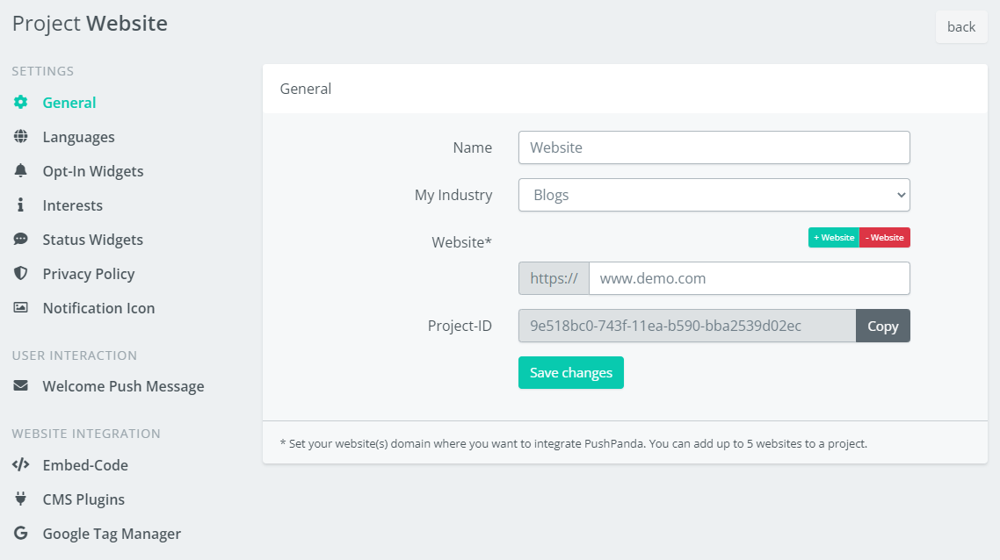

# PushPanda.io - Web Push plugin for Craft CMS 4.x

Easly integrate Web Push Notifications into your CRAFT CMS project.

## Requirements

This plugin requires Craft CMS 4.0.0 or later.

## Installation

To install the plugin, follow these instructions.

1. Open your terminal and go to your Craft project:

        cd /path/to/project

2. Then tell Composer to load the plugin:

        composer require pushpanda/craft-pushpanda

3. In the Control Panel, go to Settings → Plugins and click the “Install” button for PushPanda.io - Web Push Notifications.

## Overview

No matter what content you want to distribute, with web push notifications, you will always reach your target group with pinpoint accuracy and no wasted coverage. Online marketing has never been easier.

## Configuring PushPanda.io Plugin

To configure the plugin please follow these steps. If you already have an account skip the first two steps.

1. Register a [PushPanda.io Account](https://app.pushpanda.io/register)
2. Set up your [PushPanda Project](https://app.pushpanda.io/websites#/newWebsite) and add your website domain
3. Copy your PushPanda Project-ID 
4. Insert your Project-ID in the Plugin Settings 
5. Toogle **Enable** switch

And you're done integrating PushPanda.io in your Craft CMS website.

For **Sending Campaigns** and **Configuring your Opt-In Widgets** please use your [PushPanda.io Backend](https://app.pushpanda.io/).

## Documentation & Support

Overview, configuration, how-to guides, support:

https://support.pushpanda.io/en/

Brought to you by [PushPanda.io](https://www.pushpanda.io)